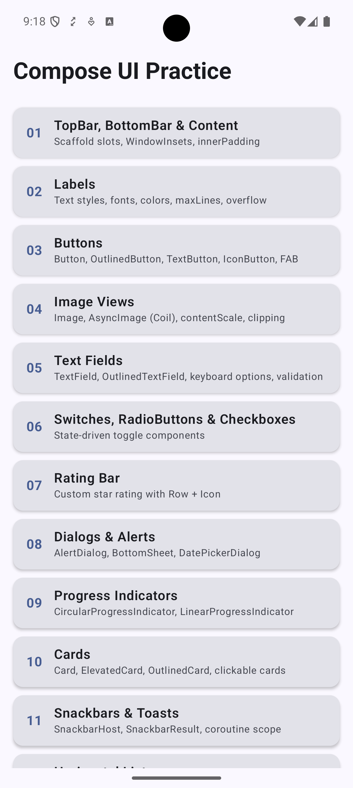
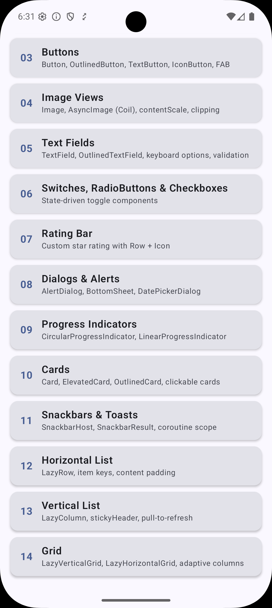

# UI With Compose

A hands-on learning sample for **Jetpack Compose** — Android's modern, declarative UI toolkit. Every screen in this app demonstrates a specific set of UI components with detailed inline comments explaining **what** each API does and **why** it works that way.

---

## Screenshots

<p align="center">
  
  &nbsp;&nbsp;&nbsp;
  
</p>
<p align="center">
  <em>Home screen — the catalogue of UI practice topics</em>
</p>

---

## What This Project Is

Most Compose tutorials show isolated snippets. This project instead builds a **navigable app** where each item on the home list opens a dedicated screen that live-demonstrates the component — with every concept labelled and explained directly in the code.

Goals:
- See every component rendered on a real device, not just in a preview
- Read the "why" alongside the "what" through thorough inline comments
- Follow a consistent, production-like architecture from the very first screen

---

## Tech Stack

| Layer | Library | Version |
|---|---|---|
| Language | Kotlin | 2.0.21 |
| UI toolkit | Jetpack Compose (BOM) | 2024.09.00 |
| Material design | Material 3 | via BOM |
| Navigation | Navigation Compose | 2.8.4 |
| Image loading | Coil | 2.7.0 |
| Min SDK | — | 24 (Android 7.0) |
| Target / Compile SDK | — | 36 |

---

## Project Structure

```
app/src/main/java/com/naveedali/uiwithcompose/
│
├── MainActivity.kt                  ← Entry point. Creates NavController, applies theme.
│
├── navigation/
│   ├── Screen.kt                    ← Sealed class — single source of truth for all routes.
│   └── AppNavGraph.kt               ← NavHost wiring every screen to its route.
│
├── model/
│   ├── ButtonModel.kt               ← Enum + data class + catalogue for Buttons screen
│   ├── CardsModel.kt                ← Enum + data class + catalogue for Cards screen
│   ├── DialogsModel.kt              ← Enum + data class + catalogue for Dialogs screen
│   ├── HorizontalListModel.kt       ← Enum + data class + catalogue for Horizontal List
│   ├── ImageViewModel.kt            ← Enum + data class + catalogue for Image Views
│   ├── ProgressIndicatorModel.kt    ← Enum + data class + catalogue for Progress screen
│   ├── RatingBarModel.kt            ← Enum + data class + catalogue for Rating Bar
│   ├── SnackbarToastModel.kt        ← Enum + data class + catalogue for Snackbars screen
│   ├── TextFieldModel.kt            ← Enum + data class + catalogue for TextFields screen
│   └── ToggleModel.kt               ← Enum + data class + catalogue for Toggles screen
│
├── screens/
│   ├── LearningHomeScreen.kt        ← Scrollable index of all practice topics
│   ├── ScaffoldDemoScreen.kt        ← 01 · TopBar, BottomBar & Content
│   ├── LabelsScreen.kt              ← 02 · Labels (Text composable)
│   ├── ButtonsScreen.kt             ← 03 · Buttons
│   ├── ImageViewsScreen.kt          ← 04 · Image Views
│   ├── TextFieldsScreen.kt          ← 05 · Text Fields
│   ├── TogglesScreen.kt             ← 06 · Switches, RadioButtons & Checkboxes
│   ├── RatingBarScreen.kt           ← 07 · Rating Bar
│   ├── DialogsScreen.kt             ← 08 · Dialogs & Alerts
│   ├── ProgressIndicatorsScreen.kt  ← 09 · Progress Indicators
│   ├── CardsScreen.kt               ← 10 · Cards
│   ├── SnackbarsToastsScreen.kt     ← 11 · Snackbars & Toasts
│   ├── HorizontalListScreen.kt      ← 12 · Horizontal List
│   ├── VerticalListScreen.kt        ← 13 · Vertical List
│   └── GridScreen.kt                ← 14 · Grid
│
└── ui/theme/
    ├── Color.kt                     ← Material 3 colour tokens
    ├── Theme.kt                     ← UiWithComposeTheme wrapper
    └── Type.kt                      ← Typography scale
```

---

## Architecture Pattern

```
MainActivity
    └── UiWithComposeTheme
            └── AppNavGraph (NavHost)
                    ├── LearningHomeScreen  ──(tap row)──►  navigate(Screen.X.route)
                    ├── ScaffoldDemoScreen  ──(back)──────►  popBackStack()
                    ├── LabelsScreen        ──(back)──────►  popBackStack()
                    ├── ButtonsScreen       ──(back)──────►  popBackStack()
                    ├── ImageViewsScreen    ──(back)──────►  popBackStack()
                    ├── TextFieldsScreen    ──(back)──────►  popBackStack()
                    ├── TogglesScreen       ──(back)──────►  popBackStack()
                    ├── RatingBarScreen     ──(back)──────►  popBackStack()
                    ├── DialogsScreen       ──(back)──────►  popBackStack()
                    ├── ProgressIndicatorsScreen ─(back)──►  popBackStack()
                    ├── CardsScreen         ──(back)──────►  popBackStack()
                    ├── SnackbarsToastsScreen ─(back)─────►  popBackStack()
                    ├── HorizontalListScreen ─(back)──────►  popBackStack()
                    ├── VerticalListScreen  ──(back)──────►  popBackStack()
                    └── GridScreen          ──(back)──────►  popBackStack()
```

Key decisions:
- **`ComponentActivity`** over `AppCompatActivity` — Compose doesn't need AppCompat's View-system baggage.
- **`NavController` created in `MainActivity`** and passed into `AppNavGraph`, so a single controller manages the whole back-stack.
- **Event hoisting** — screens don't navigate themselves; they call `onItemClick(index)` or `onBack()` and the parent (`AppNavGraph`) decides the destination.
- **Model-per-screen pattern** — each screen has a matching model file with an `enum`, `data class`, and catalogue `List`. This separates metadata from UI code and makes the `when` dispatch in each screen exhaustively type-safe.

---

## Screen Catalogue

### ✅ Implemented (14 / 14 active screens)

---

#### 01 — TopBar, BottomBar & Content
`screens/ScaffoldDemoScreen.kt`

Demonstrates all five Scaffold slots live and simultaneously:

| Slot | Component | Highlights |
|---|---|---|
| `topBar` | `TopAppBar` | navigationIcon, title, actions, colour customisation |
| `bottomBar` | `NavigationBar` + `NavigationBarItem` | selection state with `mutableIntStateOf` |
| `floatingActionButton` | `FloatingActionButton` | triggers Snackbar via coroutine scope |
| `snackbarHost` | `SnackbarHost` | `SnackbarHostState`, suspend `showSnackbar()` |
| `content` | `LazyColumn` | `innerPadding` applied correctly to avoid content hidden under bars |

---

#### 02 — Labels
`screens/LabelsScreen.kt` · `13 demos`

Covers every `Text` composable capability:

| # | Topic | What you learn |
|---|---|---|
| 01 | Typography Scale | All 15 Material 3 roles — `displayLarge` → `labelSmall` |
| 02 | Font Weight | Thin (100) → Black (900) — all 9 levels side-by-side |
| 03 | Font Style | `FontStyle.Normal` vs `FontStyle.Italic` |
| 04 | Font Family | Default, Serif, SansSerif, Monospace, Cursive + custom `.ttf` loading |
| 05 | Font Size | Explicit `sp` values — why `sp` beats `dp` for text |
| 06 | Letter Spacing | Condensed (`-0.05.em`) to very wide (`0.3.em`) |
| 07 | Line Height | Tight / normal / relaxed — same paragraph, three heights |
| 08 | Text Alignment | `Start`, `Center`, `End`, `Justify` — RTL-safe alternatives to Left/Right |
| 09 | Text Color | `colorScheme` tokens for dark-mode + custom `Color(0xFFRRGGBB)` |
| 10 | Text Decoration | `Underline`, `LineThrough`, combined via `TextDecoration.combine()` |
| 11 | Overflow & Max Lines | `Ellipsis`, `Clip`, `softWrap = false` |
| 12 | AnnotatedString | Inline bold/italic · price spans · H₂O subscript · search-match highlight |
| 13 | Selectable Text | `SelectionContainer` — long-press to copy |

---

#### 03 — Buttons
`screens/ButtonsScreen.kt` · `25 demos`

| Group | Components |
|---|---|
| Material 3 hierarchy | `Button`, `FilledTonalButton`, `OutlinedButton`, `TextButton`, `ElevatedButton` |
| Icon buttons | `IconButton`, `FilledIconButton`, `OutlinedIconButton`, `FilledTonalIconButton`, `IconToggleButton` |
| FAB variants | `FloatingActionButton`, `SmallFloatingActionButton`, `LargeFloatingActionButton`, `ExtendedFloatingActionButton` |
| States & behaviour | Disabled, Loading (coroutine-driven), leading/trailing icons, custom sizes, custom colours via `ButtonDefaults.buttonColors()`, custom shapes |
| Chips | `AssistChip`, `FilterChip` (toggleable), `InputChip` (token/tag), `SuggestionChip` |
| Segmented | `SingleChoiceSegmentedButtonRow` — mutually exclusive option selector |

---

#### 04 — Image Views
`screens/ImageViewsScreen.kt` · `14 demos`

| Group | Demos |
|---|---|
| Local resources | `painterResource()` with vector drawables |
| ContentScale | All 7 modes: `Crop`, `Fit`, `FillBounds`, `FillWidth`, `FillHeight`, `None`, `Inside` |
| Clipping | `CircleShape`, `RoundedCornerShape`, `CutCornerShape` via `Modifier.clip()` |
| Borders | Solid colour border, gradient sweep border, rounded border |
| Color filters | `ColorFilter.tint()` with `BlendMode`, greyscale via `ColorMatrix.setToSaturation(0f)`, custom sepia matrix |
| Layout | `Modifier.aspectRatio()` — 16:9, 4:3, 1:1 |
| Overlay | `Box` stack — photo + gradient scrim + `Text` on top |
| Coil `AsyncImage` | Basic, placeholder/loading slot, error fallback, crossfade animation, `CircleCropTransformation` |

---

#### 05 — Text Fields
`screens/TextFieldsScreen.kt` · `17 demos`

| Group | Demos |
|---|---|
| Core styles | `TextField` (filled), `OutlinedTextField` |
| Keyboard | `KeyboardType` variants: Text, Email, Password, Number, Phone, URI, Decimal |
| Input control | `VisualTransformation` (password masking), `ImeAction` (Next / Done / Search), `KeyboardActions` |
| Validation | Error state with `isDirty` flag to suppress premature errors |
| Advanced | Character counter, multi-line / expandable, leading/trailing icons, prefix/suffix, read-only, disabled, search pill with transparent indicator |

---

#### 06 — Switches, RadioButtons & Checkboxes
`screens/TogglesScreen.kt` · `15 demos`

| Group | Demos |
|---|---|
| Switch | Basic, thumb icon (check ↔ ×), custom colours, disabled (on & off), labeled row settings pattern with `Modifier.clickable(role = Role.Switch)` |
| Checkbox | Basic, `TriStateCheckbox` (On / Off / Indeterminate), clickable label row (`role = Role.Checkbox`), group with derived "Select All" parent via `derivedStateOf`, disabled |
| RadioButton | Basic, vertical group (theme picker), horizontal group (size picker), custom colours per option |
| Combined | Realistic notifications settings form — master Switch that dims child Checkboxes and RadioButton frequency group |

---

#### 07 — Rating Bar
`screens/RatingBarScreen.kt` · `7 demos`

Material 3 has no built-in `RatingBar` — these demos show how to build one from `Row` + `Icon` + state:

| Demo | What you learn |
|---|---|
| Basic interactive | Tap-to-rate 5-star control with integer state |
| Read-only indicator | Non-interactive display for summary scores |
| Fractional display | Partial star fill for decimal averages (e.g. 4.3 / 5) |
| Size styles | Compact, default, and hero-sized variants |
| Colour styles | Brand-coloured and status-coded rating variants |
| Rating scales | 5-star and 10-star scales from the same component |
| Review form | Mini review card combining rating + feedback text |

---

#### 08 — Dialogs & Alerts
`screens/DialogsScreen.kt` · `10 demos`

| Group | Demos |
|---|---|
| `AlertDialog` | Basic, confirmation before state change, destructive action (error colour), single-choice list with RadioButtons inside the body |
| Custom `Dialog` | Free-form card layout, small form with local input state, loading/blocking progress with `DialogProperties(dismissOnClickOutside = false)` |
| `ModalBottomSheet` | Basic sheet, action-sheet style quick actions, confirmation flow |

---

#### 09 — Progress Indicators
`screens/ProgressIndicatorsScreen.kt` · `8 demos`

| Component | Demos |
|---|---|
| `CircularProgressIndicator` | Indeterminate spinner, determinate ring driven by `Float`, size & colour variants |
| `LinearProgressIndicator` | Indeterminate sweep, determinate bar, buffered / secondary progress |
| Real-world patterns | Loading card (spinner inside a content card), file upload with percentage label |

---

#### 10 — Cards
`screens/CardsScreen.kt` · `9 demos`

| Group | Demos |
|---|---|
| Material 3 families | `Card` (default), `ElevatedCard` (stronger shadow), `OutlinedCard` (border instead of shadow) |
| Interaction & styling | Clickable card (`onClick` overload), custom colours via `CardDefaults.cardColors()`, custom shapes (rounded / cut-corner) |
| Real-world layouts | Media card (image header + supporting text), card with inline actions (save / share / open), settings summary card |

---

#### 11 — Snackbars & Toasts
`screens/SnackbarsToastsScreen.kt` · `8 demos`

| Component | Demos |
|---|---|
| `Snackbar` | Basic message via `SnackbarHostState`, with action button (Undo / Retry), handling `SnackbarResult.ActionPerformed` vs `Dismissed`, custom `SnackbarHost` styling |
| `Toast` | Basic, SHORT vs LONG duration, custom gravity/position |
| Real-world pattern | Save feedback flow comparing when a Snackbar vs Toast is the right choice |

---

#### 12 — Horizontal List
`screens/HorizontalListScreen.kt` · `7 demos`

| Demo | What you learn |
|---|---|
| Basic text chips | Minimal `LazyRow` with small chip items |
| Content padding & spacing | `contentPadding` + `horizontalArrangement` for breathing room |
| Card carousel | Horizontally scrollable promo / recommendation cards |
| Mixed view types | Different item layouts in the same `LazyRow` |
| Category selector | Selectable horizontal tab strip to switch sections |
| Featured playlists | Media-style rich tile row with image, title, subtitle |
| Quick actions | Compact dashboard shortcut tiles |

---

#### 13 — Vertical List
`screens/VerticalListScreen.kt`

`LazyColumn` patterns including sticky headers, item keys for stable recomposition, and pull-to-refresh.

---

#### 14 — Grid
`screens/GridScreen.kt`

`LazyVerticalGrid`, `LazyHorizontalGrid`, and `GridCells.Adaptive` for responsive column counts.

---

### 🔜 Coming Next

| # | Screen | Key components |
|---|---|---|
| 15 | Login Page | Form layout combining `TextField`, `Button`, validation |
| 16 | Bottom Navigation | `NavigationBar`, `NavHost`, back-stack management |
| 17 | Animations | `AnimatedVisibility`, `animate*AsState`, Transition API |

---

## How to Add a New Screen

Follow these five steps every time:

**1. Declare the route** — `navigation/Screen.kt`
```kotlin
object MyScreen : Screen("my_screen")
```

**2. Create the model** — `model/MyScreenModel.kt`
```kotlin
enum class MyDemoType { VARIANT_A, VARIANT_B }
data class MyDemo(val type: MyDemoType, val title: String, val description: String)
val myDemos: List<MyDemo> = listOf(...)
```

**3. Create the screen** — `screens/MyScreen.kt`
```kotlin
@Composable
fun MyScreen(onBack: () -> Unit = {}) {
    Scaffold(
        topBar = { TopAppBar(title = { Text("My Screen") }, navigationIcon = { /* back */ }) }
    ) { innerPadding ->
        LazyColumn(modifier = Modifier.padding(innerPadding)) {
            itemsIndexed(myDemos) { index, demo ->
                MyDemoCard(index = index + 1, demo = demo)
            }
        }
    }
}
```

**4. Register the destination** — `navigation/AppNavGraph.kt`
```kotlin
composable(route = Screen.MyScreen.route) {
    MyScreen(onBack = { navController.popBackStack() })
}
```

**5. Wire up navigation** — still in `AppNavGraph.kt`, inside the `onItemClick` `when` block
```kotlin
N -> navController.navigate(Screen.MyScreen.route)
```

---

## Key Concepts Reference

### ComponentActivity vs AppCompatActivity

```
AppCompatActivity   → Use when mixing Compose with legacy XML Views / Fragments
ComponentActivity   → Use for pure Compose projects (lighter, no View-system overhead)
```

### Scaffold innerPadding — why it matters

```kotlin
Scaffold { innerPadding ->
    YourContent(
        modifier = Modifier.padding(innerPadding)   // ← NEVER skip this
    )
}
```

`innerPadding` = height of TopAppBar + height of NavigationBar + system status/nav bar insets.
Skipping it causes content to render hidden behind bars.

### State hoisting pattern

```kotlin
// ❌ state buried inside — not reusable, not testable
@Composable fun Counter() {
    var count by remember { mutableIntStateOf(0) }
    Button(onClick = { count++ }) { Text("$count") }
}

// ✅ state hoisted — caller controls the value and the event
@Composable fun Counter(count: Int, onIncrement: () -> Unit) {
    Button(onClick = onIncrement) { Text("$count") }
}
```

### Navigation event hoisting

Screens never call `navController.navigate()` directly. They fire a lambda (`onItemClick`, `onBack`) and the parent — `AppNavGraph` — decides where to go. This keeps screens decoupled from the navigation graph and makes them independently previewable.

### rememberSaveable vs remember

```kotlin
// remember — survives recomposition, lost on rotation / process death
var query by remember { mutableStateOf("") }

// rememberSaveable — survives recomposition AND rotation (uses Bundle under the hood)
var query by rememberSaveable { mutableStateOf("") }
```

Rule of thumb: use `rememberSaveable` for any state the user has explicitly entered or chosen.

### derivedStateOf — avoiding redundant recompositions

```kotlin
// ❌ recomputes on every recomposition
val allSelected = items.all { it.selected }

// ✅ only recomputes when items actually changes
val allSelected by remember { derivedStateOf { items.all { it.selected } } }
```

---

## Getting Started

```bash
# Clone
git clone https://github.com/your-username/ui-with-compose.git

# Open in Android Studio Hedgehog or later
# Run on an emulator or device (minSdk 24)
```

No API keys, no backend — the app is entirely self-contained. Network images are loaded from `picsum.photos` (free placeholder service) to demonstrate Coil — an internet connection is required for those demos only.

---

## License

```
Copyright 2024 Naveed Ali

Licensed under the Apache License, Version 2.0 (the "License");
you may not use this file except in compliance with the License.
You may obtain a copy of the License at

    https://www.apache.org/licenses/LICENSE-2.0
```
